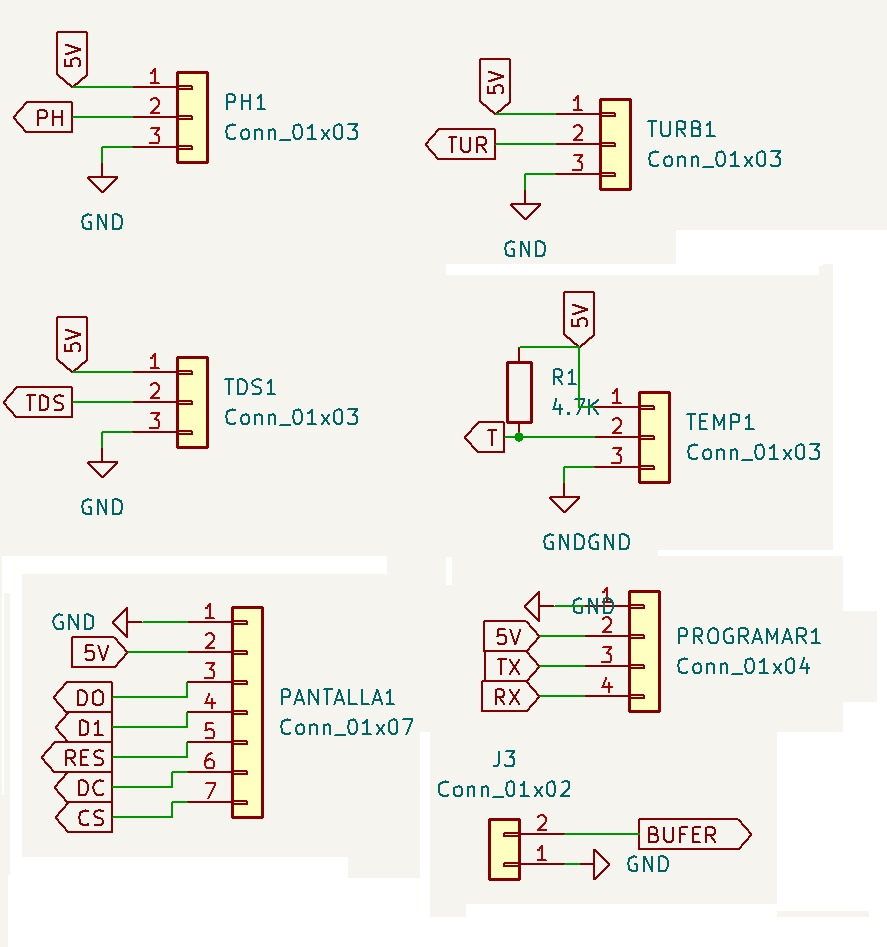
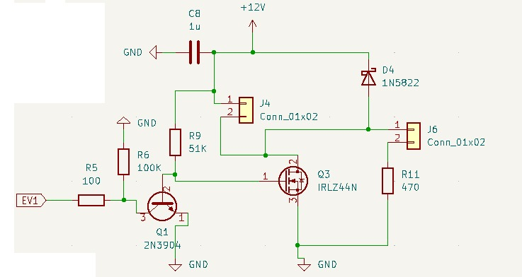
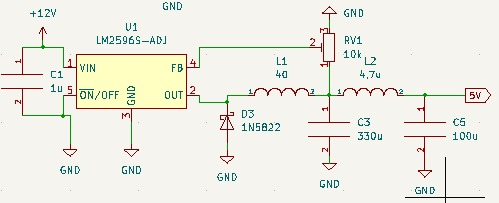
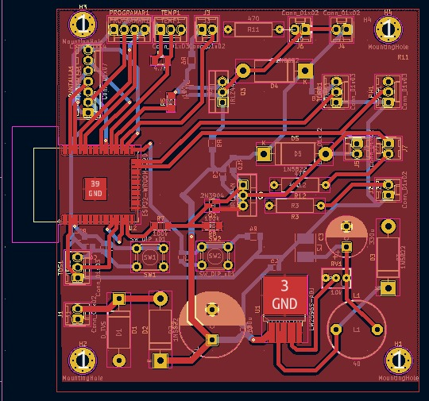

# Contexto

La piscicultura es el cultivo o crianza de peces controlada y hace parte del sector acuícola en Colombia, durante los últimos años ha aumentado el consumo de estos productos tanto al interior como al exterior del país. El sector acuícola y pesquero se ha visto beneficiado gracias a las exportaciones a distintos países, especialmente a: Estados Unidos con 53,1 millones (USD),  Ecuador con 11,7 millones (USD), Francia con 8,2 millones (USD) y España con 7,1 millones (USD) [1](https://red.uao.edu.co/bitstream/handle/10614/11594/T08756.pdf?sequence=6&isAllowed=y). Además, con los acuerdos TLC (Tratado de Libre Comercio) vigentes con estos y otros países se identificó el potencial comercial que tiene la industria respecto a la producción de camarón, tilapia y trucha, pues el porcentaje de los aranceles para estos productos serán del 0% en algunos países, por lo que es una gran oportunidad para que dicha industria se vea beneficiada[2](https://procolombia.co/archivo/productos-acuicolas-y-pesqueros-llegan-mesas-europeas-asiaticas-y-norteamericanas).

Una de las razones, por la que los productos acuícolas y pesqueros colombianos tienen acogida en países extranjeros es debido a que se perciben como alimentos saludables y de producción sostenible, lo cual, es uno de los objetivos del sector piscícola, la obtención de una proteína con calidad dietaria para cubrir la demanda que la pesca libre no llega a generar.

# Planteamiento del Problema

Para que los productores aprovechen dichas ventajas del mercado, se hace necesario que obtengan los resultados esperados en la crianza de los peces para su posterior venta, sin embargo, uno de los problemas identificados es el ambiente poco controlado de los estanques de crianza de peces, según la FAO las etapas de mayor riesgo e incertidumbre por el alto índice de mortalidad, son en las ovas, las larvas y los alevinos, puesto que son suceptibles a cambios en los niveles de PH y de oxígeno disuelto como principales factores. También se debe mantener un control de las sustancias quimicas usadas en los estanques para su defección y tratamienta, puesto que se pueden sobrepasar las cantidades límite que protegen la salud de los peces, como  el amonio y los nitritos, los cuales presentan un indicador mayor de toxidad que se origina  son por las heces de los animales [4](https://lainholding.com/tilapia-control-de-calidad-del-agua/)
Otr
# Propuesta

Cada una de estas variables puede afectar la salud de los peces, cualquier nivel impropio de oxígeno disuelto, nitritos o sulfuro de hidrógeno los lleva a sufrir estrés y enfermedades, los niveles de temperatura y PH desbalanceados aumentan la toxicidad del amoníaco y del sulfuro de hidrógeno [3(https://aquafeed.co/entrada/monitoreo-de-la-calidad-de-agua-del-estanque-para-mejorar-la-producci-n-de-camarones-y-peces-20528/)
por tal razón se plantea un sistema de monitoreo de agua para la piscicultura de tilapia. 

El sistema de monitoreo, de ahora en adelante SIMAP

# Esquema funcional

# Diseño de la PCB en KiCad

La PCB fue diseñada en KiCAD siguiendo el standar, esto se completara mas adelante.
Se realizo el ruteo y se finalizo la PCB quedando de la siguiente forma:

# Esquemático

# Etapa de procesador

# Etapa de sensores y salidas

# Etapa de Actuadores

# Etapa de potencia

# PCB en KiCad

# Diseño en 3D

# PCB lista para soldar
## Top

## Bottom

# Proceso de Montaje de componentes en la PCB

## Prueba de Pantalla

## Pruebas de sensores
se adjuntan videos de las pruebas de los sensores, mas adelante se redactara mejor esta seccion:

### Sensor de temperatura

<iframe width="640" height="352" src="Imagenes/Temp_Kish.mp4" type="video/mp4">
</iframe>

### Sensor de PH

<iframe width="854" height="480" src="Imagenes/PH_Juan.mp4" type="video/mp4">
</iframe>

### Sensor Turbidez

<iframe width="854" height="480" src="Imagenes/P_Turbio_1.mp4" type="video/mp4">
</iframe>

