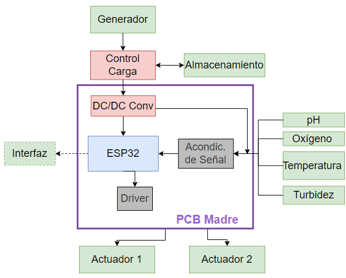
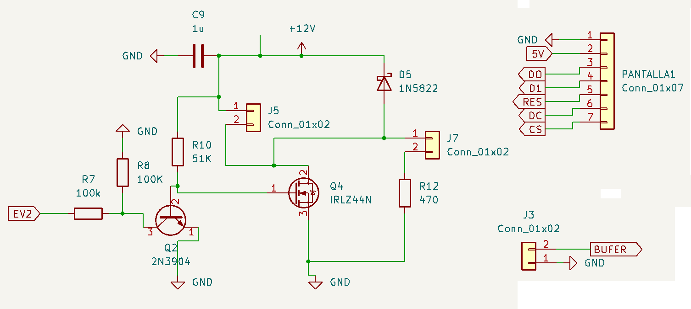
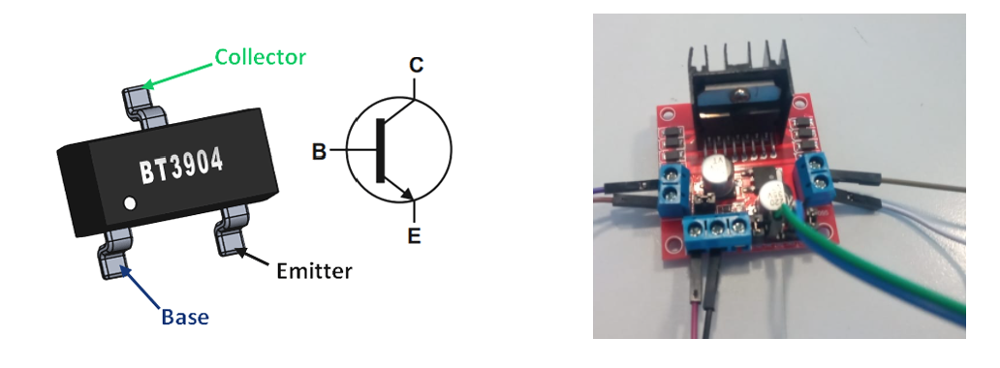
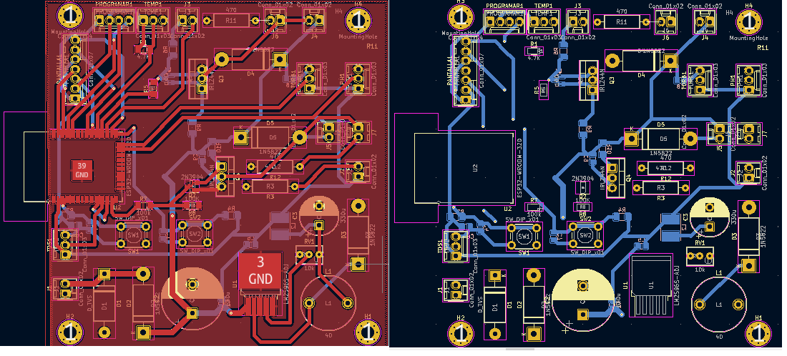
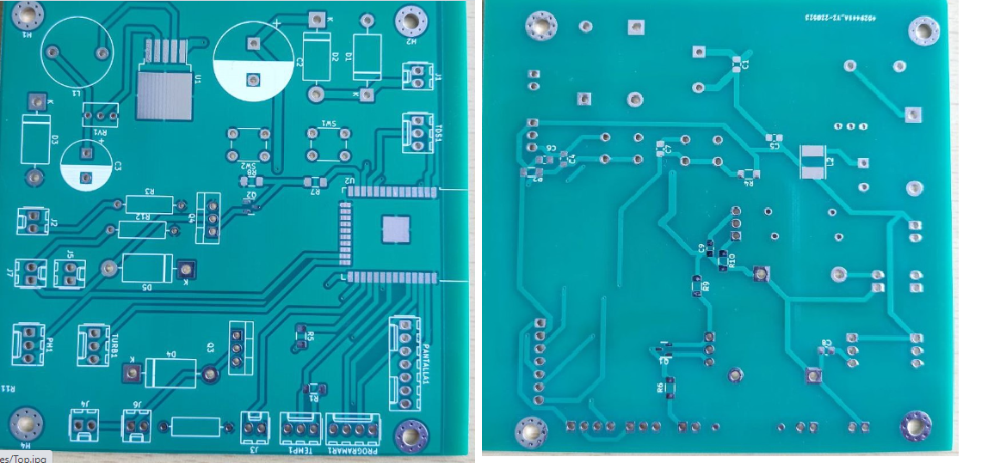
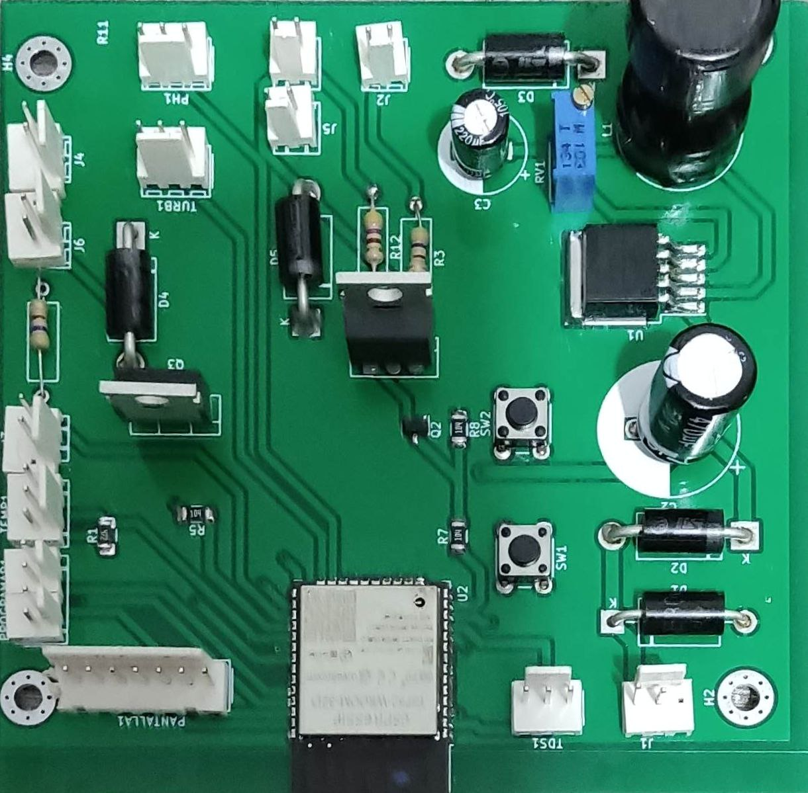
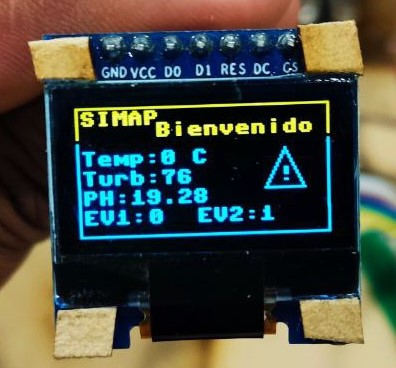
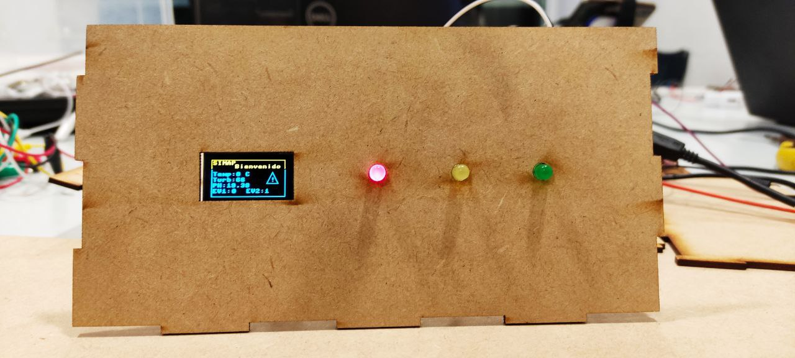

# Contexto

La piscicultura es el cultivo o crianza de peces controlada y hace parte del sector acuícola en Colombia, durante los últimos años ha aumentado el consumo de estos productos tanto al interior como al exterior del país. El sector acuícola y pesquero se ha visto beneficiado gracias a las exportaciones a distintos países, especialmente a: Estados Unidos con 53,1 millones (USD),  Ecuador con 11,7 millones (USD), Francia con 8,2 millones (USD) y España con 7,1 millones (USD) [1](https://red.uao.edu.co/bitstream/handle/10614/11594/T08756.pdf?sequence=6&isAllowed=y). Además, con los acuerdos TLC (Tratado de Libre Comercio) vigentes con estos y otros países se identificó el potencial comercial que tiene la industria respecto a la producción de camarón, tilapia y trucha, pues el porcentaje de los aranceles para estos productos serán del 0% en algunos países, por lo que es una gran oportunidad para que dicha industria se vea beneficiada [2](https://procolombia.co/archivo/productos-acuicolas-y-pesqueros-llegan-mesas-europeas-asiaticas-y-norteamericanas).

Una de las razones, por la que los productos acuícolas y pesqueros colombianos tienen acogida en países extranjeros es debido a que se perciben como alimentos saludables y de producción sostenible, lo cual, es uno de los objetivos del sector piscícola, la obtención de una proteína con calidad dietaria para cubrir la demanda que la pesca libre no llega a generar.

# Planteamiento del Problema

Para que los productores aprovechen dichas ventajas del mercado, se hace necesario que obtengan los resultados esperados en la crianza de los peces para su posterior venta, sin embargo, uno de los problemas identificados es el ambiente poco controlado de los estanques de crianza de peces, según la FAO las etapas de mayor riesgo e incertidumbre por el alto índice de mortalidad, son en las ovas, las larvas y los alevinos, puesto que son suceptibles a cambios en los niveles de PH y de oxígeno disuelto como principales factores [3](https://lainholding.com/tilapia-control-de-calidad-del-agua/).. También se debe mantener un control de las sustancias quimicas usadas en los estanques para su defección y tratamienta, puesto que se pueden sobrepasar las cantidades límite que protegen la salud de los peces, como  el amonio y los nitritos, los cuales presentan un indicador mayor de toxidad que se origina  son por las heces de los animales [4](https://www.hannacolombia.com/aqua/blog/item/monitoreo-de-agua-en-piscicultura).

# Propuesta

Cada una de estas variables puede afectar la salud de los peces, cualquier nivel impropio de oxígeno disuelto, nitritos o sulfuro de hidrógeno los lleva a sufrir estrés y enfermedades, los niveles de temperatura y PH desbalanceados aumentan la toxicidad del amoníaco y del sulfuro de hidrógeno [5](https://aquafeed.co/entrada/monitoreo-de-la-calidad-de-agua-del-estanque-para-mejorar-la-producci-n-de-camarones-y-peces-20528/)
por tal razón se plantea un sistema de monitoreo de agua para la piscicultura de tilapia. 

A continuación, se describen los principales parámetros que influyen en la calidad del agua durante la crianza de los peces [6](https://bernardolabs.com/parametros-clave-de-la-calidad-del-agua-para-piscicultura/):

- PH, controla las cantidades disueltas en el agua de varios tipos de sustancias, generalmente un rango óptimo de PH se encuentra ente 6,5 y 8,2.
- Temperatura, puede afectar el metabolismo de peces y camarones, los índices de alimentación y el grado de toxicidad de amoníaco, también impacta en los índices de respiración de la biota (consumo de O2) e influencia la solubilidad del o2 (agua más cálida contiene menos o2 que el agua más fresca).
- Turbidez, se relaciona con el nivel de filtrado en el agua, algunas especies no toleran una turbidez elevada.
- Dióxido de Carbono, al perturbar la absorción de oxígeno afecta el comportamiento de los peces, produciendoles estrés.
- Oxígeno disuelto, la sobresaturación del oxígeno puede ser perjudicial para la producción de peces.
- Amoníaco y Nitritos, los altos niveles de nitritos afectan la disponibilidad de oxígeno, puesto que estimulan el desarrollo de plancton y el amoníaco reduce la capacidad de los peces para llevar oxígeno a la sangre y puede sofocarlos.
- Alcalinidad, evita los cambios bruscos del pH. Niveles de alcalinidad de 100 a 120 mg/L con pH entre 7 y 8 son reconocidos como los más favorables para una vida acuática de mayor variedad.

De acuerdo con lo anterior, se investigaron y cotizaron los siguientes ensores.

# Sensores Investigados 

## Sensor de PH

| Sensor | Temperatura | Costo | Precisión |
| ------------- | ------------- | ------------- | ------------- |
| SEN0161 | 0 - 60 °C  | $ 154.700 cop  | ± 0.1 pH (25 ℃) |
| DFR0300 | 0 - 40 °C   | $ 357.000 cop  | ± 5% |
| PH - 4502C | 0 - 80 °C   | $ 51.200 cop  | ± 5% |

## Sensor de Turbidez

| Sensor | Temperatura | Costo | Precisión |
| ------------- | ------------- | ------------- | ------------- |
| SEN0189 | -50 - 90 °C  | $ 57.120 cop  | 10% |
| TSW-20M | -30 - 80 °C   | $ 49.000 cop  | ± 5% |

## Sensor de Temperatura

| Sensor | Temperatura | Costo | Precisión |
| ------------- | ------------- | ------------- | ------------- |
| MTK-01 | -40 - +204 °C  | $ 14.875 cop  | ± 0,75°C Leit. o ± 2.2 °C |
| SEN PT100 | -50 - +250 °C   |  | ± 0,5 °C |
| SEN DS18B20 | -55 - +125 °C   | $ 19.992  | ± 0,5 °C|

## Dióxido de Oxígeno Disuelto

| Sensores | Sensor de CO2 disuelto en agua | Sensor de CO2 disuelto óptico |
| --- | --- | --- | 
| Descripción | Es un módulo de detección de gas para detectar la concentración de dióxido de carbono en una solución acuosa | El sensor está diseñado para una profundidad de hasta 1.000 m, tiene una salida analógica o digital, una absorción de corriente reducida |
| Especificación | |Conector: Subconn MCBH4M, Fuente de alimentación: 12-30 V CC al usar la salida digital o de voltaje o 20-30 V CC al usar la salida de corriente, Consumo de energía: <0,5 W |
| Precio (COP) | 378.206,40 - 2.647.444,80  | Cotización |
| Integración al sistema | Tiene UART, salida digital CII, salida de V analógica | Se entrelaza con sistemas de sonda CTD externos |
| Enlace de Compra | [Alibaba](https://spanish.alibaba.com/product-detail/kws5000-dissolved-co2-sensor-in-water-62249774554.html) | [Alibaba](https://spanish.alibaba.com/product-detail/Membrane-Covered-Optical-Dissolved-CO2-Sensor-60692709391.html) | 


## Sensor Oxígeno Disuelto

| Sensores | Sensor de oxígeno disuelto con comunicación digital  | Sensor Medidor de Oxígeno | Sensor de oxígeno disuelto galvanizado | Sonda Óptica de Oxígeno Disuelto|
| --- | --- | --- | --- | --- |
| Modelo | DO6400  |  REF DO-5510 | DO1200  | OD 8525 |
| Descripción | Sensor galvánico de oxígeno disuelto  | Se utiliza la salida de 9 pines del conector DIN. | Mide el contenido de oxígeno del agua utilizando un principio de medición electroquímico.  | Sonda de inmersión. Mide oxígeno disuelto mediante fluorescencia. |
| Precio (COP) | $ 2.218.585,22 – $ 2.964.929,55  | $915,278.15  | 892.267,20 -1.003.800,60 | $ 529.622 |
| Integración al sistema | Utiliza señal de salida digital (mv), 4-20 mA o MODBUS/RS485 | Sonda de oxígeno disuelto  | | Proporciona una señal de bucle de corriente  4-20 mA se puede suministrar a un PLC, o una salida digital RS485. |
| Especificaciones | Tensión de entrada: 12 V CC: solo MODBUS 24 V CC – 4-20 mA y MODBUS |  |  | Alimentación: 9/36 Vcc, Temperatura: -5/50 °C, Presión: máx. 25 °C |
| Enlace de Compra | [Sensorex](https://sensorex.com/product/do6400-dissolved-oxygen-sensor-with-digital-communication/) | [Opensky](https://www.openskycolombia.com/equipos/sensor-para-medidor-de-oxigeno-ref-do-5510-marca-lutron-modelo-oxpb-09n/) | [Sensorex](https://sensorex.com/product/do1200-galvanic-dissolved-oxygen-sensor/) | [Instrumatic](https://instrumatic.com.co/producto/sonda-optica-de-oxigeno-disuelto-od-8525/) [Mercado Libre](https://articulo.mercadolibre.com.co/MCO-632803463-medidor-de-oxigeno-disuelto-profesional-digital-disuelto-oxi-_JM#position=51&search_layout=stack&type=item&tracking_id=952ea0b8-07f6-4bc8-9dc4-447e8dacd8dc) 

# Esquema funcional
De acuerdo con la información investigada, se planteó el siguiente esquema funcional para el desarrollo del sistema de monitoreo, el cual consta de un bloque central llamado "PCB Madre" que consta del módulo de programación de la ESP 32 el cual recibirá la información a través del acondicionamiento de la señales que sean recolectadas de los sensores de PH, oxígeno, temperatura, turbidez, y nitrato. Este módulo a suvez contará con su correspoendiente driver y un convertidor DC/DC para su alimentación, el almacenamiento de los datos y un calentador de agua. La información que se recolecté a partir de los sensores se podrá visualizar en una interfaz.




# Diseño de la PCB en KiCad

La PCB fue diseñada en KiCAD siguiendo el standar, esto se completara mas adelante.
Se realizo el ruteo y se finalizo la PCB quedando de la siguiente forma:

# Esquemático


# Etapa de potencia
Se pensó en una alimentación de 12V  en caso de la utilización de la batería, en los lugares  del campo que no tiene acceso a red eléctrica.  EL TVS es  para la protección  en caso de sobretensión.   El 1N5822 es un  rectificador de barrera Schottky es un diodo de potencia ideal para ser usado como rectificador en inversores de baja tensión. el condensador  es un  filtro a posibles ruidos 


## El Convertidor  de 12V a  3,3V 
El chip de la ESP32 requieren una alimentación  de 3,3V  los demás sensores seleccionados funcionan en tensiones 5V a 3,3V   por practicidad 3,3V para el funcionamiento de todos los dispositivos. Se diseñó el circuito propuesto por el datashee del convertidor LM2596s


# Etapa de procesador

La ESP32 requiere  de la alimentación  pin 1 ( GND)  2(3,3v)   seguidamente de los    botones de   programación en los pines  3 EN y  25 


# Etapa de sensores
A continuación los sensores  que se dividen en dos  grupos digital ( DS18B20 Tem) y  análogos(pH, turbidez. )  


## Acoples de PH , turbidez y  temperatura

 El sensor   de temperatura  requería una resistencia   en su acople  los demás sensores  traen sus módulos


# Etapa de Actuadores y salida

Para   los dos actuadores  se usaron  2 relés, se diseñó un circuito para su acople.  Existen  una pantalla y buffer  para la comunicación  humana. 




# Errores  de  diseño 

Error en la   huella de  BT3904  





A la capa  button  no se le puso la capa de tierra. 



# PCB lista para soldar
Para la  impresión de la  PCB   se recurrió a JLC PCB que  es una  empresa  China. Además  de mandar  la información  de kitkat  se recurre  a otros software  para  la   perforación  de la PCB.  El costo  total  fue 16 dólares, para 5 placas con  envio de 9 días.    

## Top Y Bottom



# Proceso de Montaje de componentes en la PCB

Luego de tener la PCB se procede al proceso de montaje de los componentes, una parte fue hecha por nosotros y el SOC fue puesto por ALexa Ocampo laboratorista de Mecatronica quien nos acompaño en todo  el proceso.


Despues de un arduo trabajo se tiene la PCB con sus componentes puestos quedando de la siguiente forma:



# Pruebas 

## Prueba de Pantalla

Como principal forma de interacción con el dispositivo se utiliza la pantalla OLED (128x64) de 0.96 pulgadas SSD1306, esta pantalla utiliza una comunicación SPI la cual se realiza mediante las librerías disponibles en Micro Python. Las librerías principales para utilizar la pantalla son GFX y SSD1306. En el código principal se crean los objetos correspondientes a las librerías “graphics” y “oled” respectivamente.
```Python
from machine import Pin, ADC, SoftSPI
import ssd1306
import gfx
from time import sleep

# ESP32 Pin assignment

spi = SoftSPI(sck=Pin(18), mosi=Pin(23), miso=Pin(21))
dc = Pin(19)
res = Pin(22)
cs = Pin(4)

oled = ssd1306.SSD1306_SPI(oled_width, oled_height, spi, dc, res, cs)
graphics = gfx.GFX(oled_width, oled_height, oled.pixel)
```
El método utilizado para escribir todos los textos incluidas las lecturas de los sensores es el método text() del objeto oled, utilizando este método se hace la función que escribe lo que el usuario final vera en la pantalla 
```Python
def showParam(tmp, turb, PH, EV1, EV2):
    #Titulo
    oled.text("SIMAP",2,2, WHITE)
    oled.text("Bienvenido",40,9, WHITE)
    #Menu
    oled.text("Temp: ",2,20, WHITE)
    oled.text("Turb:",2,30, WHITE)
    oled.text("PH:",2,40, WHITE)
    oled.text("EV1:",2,50, WHITE)
    oled.text("EV2:",60,50, WHITE)
    #Datos
    oled.text(str(tmp)+" C",42,20, WHITE)
    oled.text(str(turb),42,30, WHITE)
    oled.text(str(PH),26,40, WHITE)
    oled.text(EV1,35,50, WHITE)
    oled.text(EV2,92,50, WHITE)
    oled.show()
```
Por otra parte, para actualizar las lecturas y dibujar diversas formas se utilizan los diferentes métodos del objeto graphics como line(), fill_rect(), entre otros, un ejemplo es la función de lectura del PH donde se dibuja un rectángulo negro para actualizar el dato.
```Python
def PHread():
    
    global PHval
    
    if (PH.read()!=0):
       if(PH.read()!=PHval):
         PHval=round((22.0461-0.0196*PH.read()), 2)
         graphics.fill_rect(26,40,40,7,BLACK);
```
Haciendo uso de  todo lo mencionado se prueba la pantalla con un módulo ESP32 genérico haciendo que muestre lo que se ve en la imagen.


## Sensor de temperatura

El sensor  de  temperatura  es un sensor digital que   tiene  dos posibles formas de  configuración 


Se comunica a través de un bus de 1 cable que, por definición, sólo requiere una línea de datos (y tierra) para la comunicación con una central  microprocesadora.

Energía directamente desde la línea de datos ("energía parásita")


<iframe width="640" height="352" src="Imagenes/Temp_Kish.mp4" type="video/mp4">
</iframe>


## Sensor de PH
El parámetro de pH se mide   de 0 a 14,  siendo el  agua  7  que es neutro. 7,1 hasta 14 es básico y de 0 a 6,9 es ácido.  se recomienda no medir productos muy ácidos  cercano a cero, o muy alcalinos cercanos a 14 puede dañar el sensor.   
``` Python
def PHread():
    
    global PHval
    
    if (PH.read()!=0):
       if(PH.read()!=PHval):
         PHval=round((22.0461-0.0196*PH.read()), 2)
         graphics.fill_rect(26,40,40,7,BLACK)
         oled.show()
```

<iframe width="854" height="480" src="Imagenes/PH_Juan.mp4" type="video/mp4">
</iframe>

## Sensor Turbidez

El  principio  de funcionamiento del sensor de turbidez es por  intensidad de iluminación, se tiene un fotoemisor y  un fotorreceptor,  según la difracción o disminución en la intensidad se calcula. sus  unidades nefelométricas de turbidez (NTU)
```Python
def TRBread():
    
    global turb
    
    if (TRB.read()!=0):
       if(TRB.read()!=turb):
           
         turb=TRB.read()
#          turb=round(((-1120.4*math.sqrt(TRB.read()3.3/(1023)))+5742.3(TRB.read()*3.3/(1023))-4353.8), 2)
         graphics.fill_rect(42,30,40,7,BLACK)
         oled.show()
```
<iframe width="854" height="480" src="Imagenes/P_Turbio_1.mp4" type="video/mp4">
</iframe>
 
 # Diseño en 3D y Corte Láser

## 
El diseño de la caja del sistema se realiza en el programa Fusion 360, para esto se descargó el modelo 3D de la PCB en KiCad para tener en cuenta los parámetros y medidas correspondientes. A continuación el modelo 3D del sistema:

 [^1]

[^1]: Los modelos 3D de los componentes usados en la animación fueron tomados de https://grabcad.com/ 

## Corte Láser
Para el montaje final del sistema, se realizó el plano en 2D para corte láser.

 
 
# Montaje 
Ya teniendo los cortes de la caja se procede a poner los componentes que van en sus paredes, como son terminales de los sensores, display y LEDs.



Luego de poner los Leds y el display se tiene la parte frontal, vamos a empezar a pegar la caja.



Primero se fijan las piezas de la caja con superbonder.


Luego de tener lacaja fija se pone una capa de colbon de madera para tener una estructura mas firme.


