# Contexto

La piscicultura es el cultivo o crianza de peces controlada y hace parte del sector acuícola en Colombia, durante los últimos años ha aumentado el consumo de estos productos tanto al interior como al exterior del país. El sector acuícola y pesquero se ha visto beneficiado gracias a las exportaciones a distintos países, especialmente a: Estados Unidos con 53,1 millones (USD),  Ecuador con 11,7 millones (USD), Francia con 8,2 millones (USD) y España con 7,1 millones (USD) [1](https://red.uao.edu.co/bitstream/handle/10614/11594/T08756.pdf?sequence=6&isAllowed=y). Además, con los acuerdos TLC (Tratado de Libre Comercio) vigentes con estos y otros países se identificó el potencial comercial que tiene la industria respecto a la producción de camarón, tilapia y trucha, pues el porcentaje de los aranceles para estos productos serán del 0% en algunos países, por lo que es una gran oportunidad para que dicha industria se vea beneficiada [2](https://procolombia.co/archivo/productos-acuicolas-y-pesqueros-llegan-mesas-europeas-asiaticas-y-norteamericanas).

Una de las razones, por la que los productos acuícolas y pesqueros colombianos tienen acogida en países extranjeros es debido a que se perciben como alimentos saludables y de producción sostenible, lo cual, es uno de los objetivos del sector piscícola, la obtención de una proteína con calidad dietaria para cubrir la demanda que la pesca libre no llega a generar.

# Planteamiento del Problema

Para que los productores aprovechen dichas ventajas del mercado, se hace necesario que obtengan los resultados esperados en la crianza de los peces para su posterior venta, sin embargo, uno de los problemas identificados es el ambiente poco controlado de los estanques de crianza de peces, según la FAO las etapas de mayor riesgo e incertidumbre por el alto índice de mortalidad, son en las ovas, las larvas y los alevinos, puesto que son suceptibles a cambios en los niveles de PH y de oxígeno disuelto como principales factores. También se debe mantener un control de las sustancias quimicas usadas en los estanques para su defección y tratamienta, puesto que se pueden sobrepasar las cantidades límite que protegen la salud de los peces, como  el amonio y los nitritos, los cuales presentan un indicador mayor de toxidad que se origina  son por las heces de los animales [4](https://lainholding.com/tilapia-control-de-calidad-del-agua/)
Otr
# Propuesta

Cada una de estas variables puede afectar la salud de los peces, cualquier nivel impropio de oxígeno disuelto, nitritos o sulfuro de hidrógeno los lleva a sufrir estrés y enfermedades, los niveles de temperatura y PH desbalanceados aumentan la toxicidad del amoníaco y del sulfuro de hidrógeno [3](https://aquafeed.co/entrada/monitoreo-de-la-calidad-de-agua-del-estanque-para-mejorar-la-producci-n-de-camarones-y-peces-20528/)
por tal razón se plantea un sistema de monitoreo de agua para la piscicultura de tilapia. 

# Sensores Investigados 

## Sensor de PH

| Sensor | Temperatura | Costo | Precisión |
| ------------- | ------------- | ------------- | ------------- |
| SEN0161 | 0 - 60 °C  | $ 154.700 cop  | ± 0.1 pH (25 ℃) |
| DFR0300 | 0 - 40 °C   | $ 357.000 cop  | ± 5% |
| PH - 4502C | 0 - 80 °C   | $ 51.200 cop  | ± 5% |

## Sensor de Turbidez

| Sensor | Temperatura | Costo | Precisión |
| ------------- | ------------- | ------------- | ------------- |
| SEN0189 | -50 - 90 °C  | $ 57.120 cop  | 10% |
| TSW-20M | -30 - 80 °C   | $ 49.000 cop  | ± 5% |

## Sensor de Temperatura

| Sensor | Temperatura | Costo | Precisión |
| ------------- | ------------- | ------------- | ------------- |
| MTK-01 | -40 - +204 °C  | $ 14.875 cop  | ± 0,75°C Leit. o ± 2.2 °C |
| SEN PT100 | -50 - +250 °C   |  | ± 0,5 °C |
| SEN DS18B20 | -55 - +125 °C   | $ 19.992  | ± 0,5 °C|

## Dióxido de Oxígeno Disuelto

| Sensores | Sensor de CO2 disuelto en agua | Sensor de CO2 disuelto óptico |
| --- | --- | --- | 
| Descripción | Es un módulo de detección de gas para detectar la concentración de dióxido de carbono en una solución acuosa | El sensor está diseñado para una profundidad de hasta 1.000 m, tiene una salida analógica o digital, una absorción de corriente reducida |
| Especificación | |Dimensiones: 225mm de longitud, 33mm de diámetro, Conector: Subconn MCBH4M, Fuente de alimentación: 12-30 V CC al usar la salida digital o de voltaje o 20-30 V CC al usar la salida de corriente, Consumo de energía: <0,5 W |
| Precio (COP) | 378.206,40 - 2.647.444,80  | Cotización |
| Integración al sistema | Tiene UART, salida digital CII, salida de tensión analógica y  salida de frecuencia PWM | Se entrelaza con sistemas de sonda CTD externos |
| Enlace de Compra | [Alibaba](https://spanish.alibaba.com/product-detail/kws5000-dissolved-co2-sensor-in-water-62249774554.html) | [Alibaba](https://spanish.alibaba.com/product-detail/Membrane-Covered-Optical-Dissolved-CO2-Sensor-60692709391.html) | 

## Sensor Oxígeno Disuelto

| Sensores | Sensor de oxígeno disuelto con comunicación digital  | Sensor Medidor de Oxígeno | Sensor de oxígeno disuelto galvanizado | Sonda Óptica de Oxígeno Disuelto|
| --- | --- | --- | --- | --- |
| Modelo | DO6400  |  REF DO-5510 | DO1200  | OD 8525 |
| Descripción | Sensor galvánico de oxígeno disuelto  | Se utiliza la salida de 9 pines del conector DIN. | Mide el contenido de oxígeno del agua utilizando un principio de medición electroquímico.  | Sonda de inmersión. Mide oxígeno disuelto mediante fluorescencia. |
| Precio (COP) | $ 2.218.585,22 – $ 2.964.929,55  | $915,278.15  | 892.267,20 -1.003.800,60 | $ 529.622 |
| Integración al sistema | Utiliza señal de salida digital (mv), 4-20 mA o MODBUS/RS485 | Sonda de oxígeno disuelto  | | Proporciona una señal de bucle de corriente  4-20 mA se puede suministrar a un PLC, o una salida digital RS485. |
| Especificaciones | Tensión de entrada: 12 V CC: solo MODBUS 24 V CC – 4-20 mA y MODBUS |  |  | Alimentación: 9/36 Vcc, Temperatura: -5/50 °C, Presión: máx. 6 bar a 25 °C, Longitud: 143 mm, Cable: 10 m |
| Enlace de Compra | [Sensorex](https://sensorex.com/product/do6400-dissolved-oxygen-sensor-with-digital-communication/) | [Opensky](https://www.openskycolombia.com/equipos/sensor-para-medidor-de-oxigeno-ref-do-5510-marca-lutron-modelo-oxpb-09n/) | [Sensorex](https://sensorex.com/product/do1200-galvanic-dissolved-oxygen-sensor/) | [Instrumatic](https://instrumatic.com.co/producto/sonda-optica-de-oxigeno-disuelto-od-8525/) [Mercado Libre](https://articulo.mercadolibre.com.co/MCO-632803463-medidor-de-oxigeno-disuelto-profesional-digital-disuelto-oxi-_JM#position=51&search_layout=stack&type=item&tracking_id=952ea0b8-07f6-4bc8-9dc4-447e8dacd8dc) 

# Esquema funcional

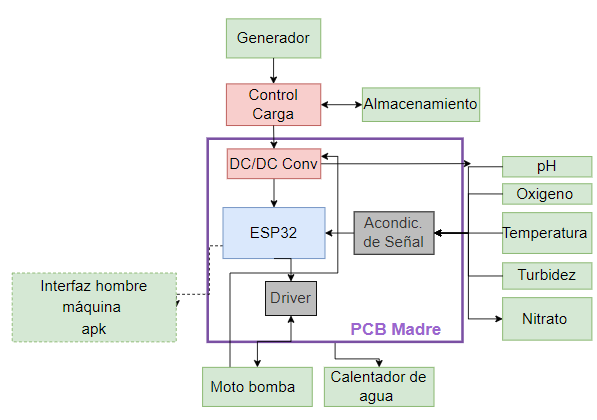

# Diseño de la PCB en KiCad

La PCB fue diseñada en KiCAD siguiendo el standar, esto se completara mas adelante.
Se realizo el ruteo y se finalizo la PCB quedando de la siguiente forma:

# Esquemático

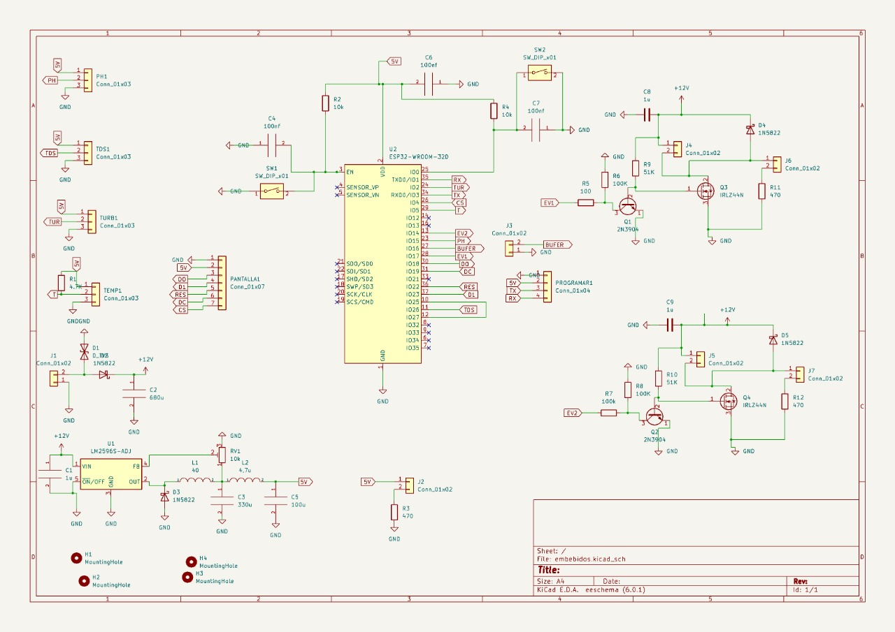

# Etapa de potencia
Se pensó en una alimentación de 12V  en caso de la utilización de la batería, en los lugares  del campo que no tiene acceso a red eléctrica.  EL TVS es  para la protección  en caso de sobretensión.   El 1N5822 es un  rectificador de barrera Schottky es un diodo de potencia ideal para ser usado como rectificador en inversores de baja tensión. el condensador  es un  filtro a posibles ruidos 

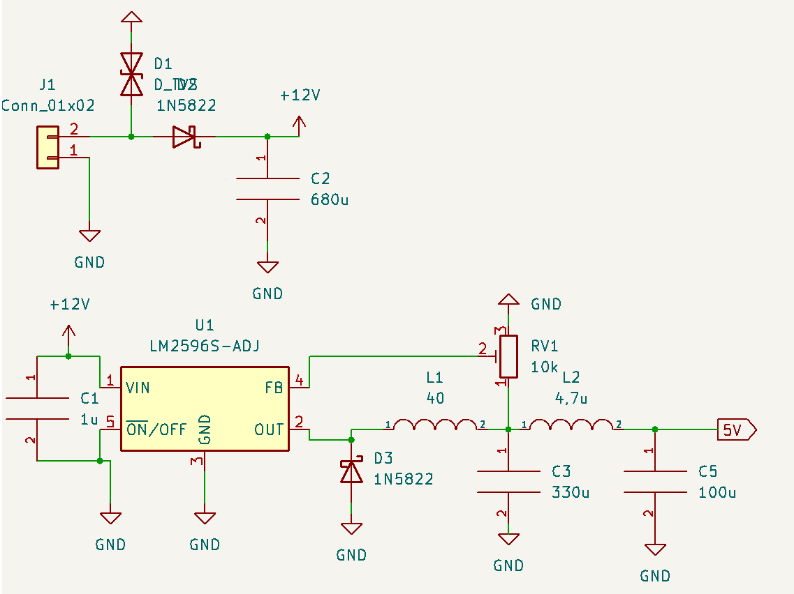

## El Convertidor  de 12V a  3,3V 
El chip de la ESP32 requieren una alimentación  de 3,3V  los demás sensores seleccionados funcionan en tensiones 5V a 3,3V   por practicidad 3,3V para el funcionamiento de todos los dispositivos. Se diseñó el circuito propuesto por el datashee del convertidor LM2596s

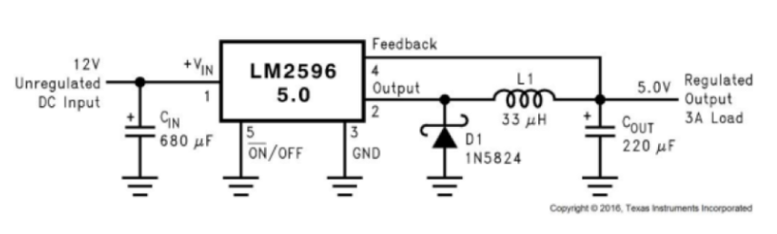

# Etapa de procesador

La ESP32 requiere  de la alimentación  pin 1 ( GND)  2(3,3v)   seguidamente de los    botones de   programación en los pines  3 EN y  25 

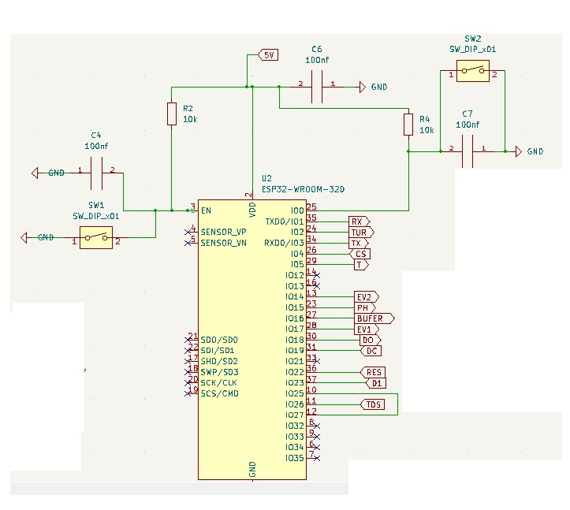

# Etapa de sensores
A continuación los sensores  que se dividen en dos  grupos digital ( DS18B20 Tem) y  análogos(pH, turbidez. )  
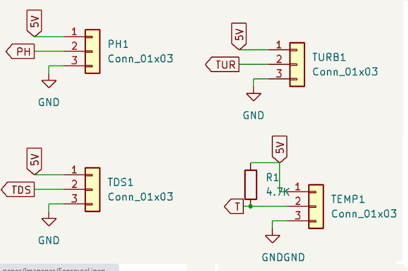

## Acoples de PH , turbidez y  temperatura

 El sensor   de temperatura  requería una resistencia   en su acople  los demás sensores  traen sus módulos
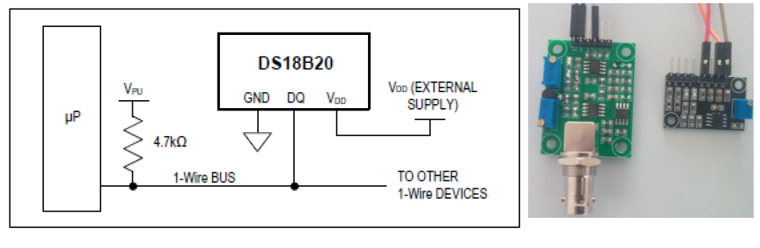

# Etapa de Actuadores y salida

Para   los dos actuadores  se usaron  2 relés, se diseñó un circuito para su acople.  Existen  una pantalla y buffer  para la comunicación  humana. 

# Errores  de  diseño 

Error en la   huella de  BT3904  

A la capa  button  no se le puso la capa de tierra. 

# Diseño en 3D

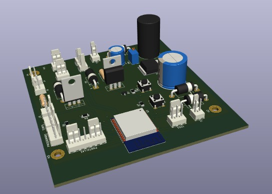

# PCB lista para soldar
## Top
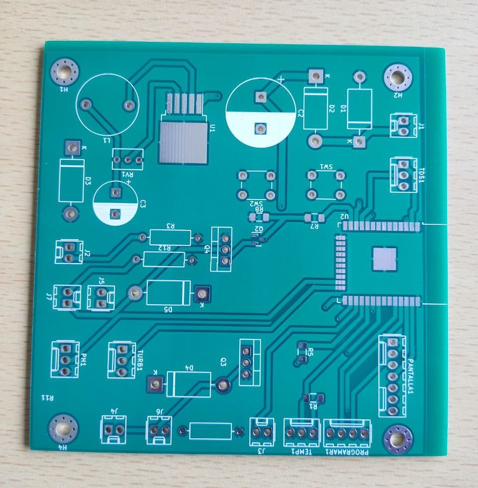

## Bottom
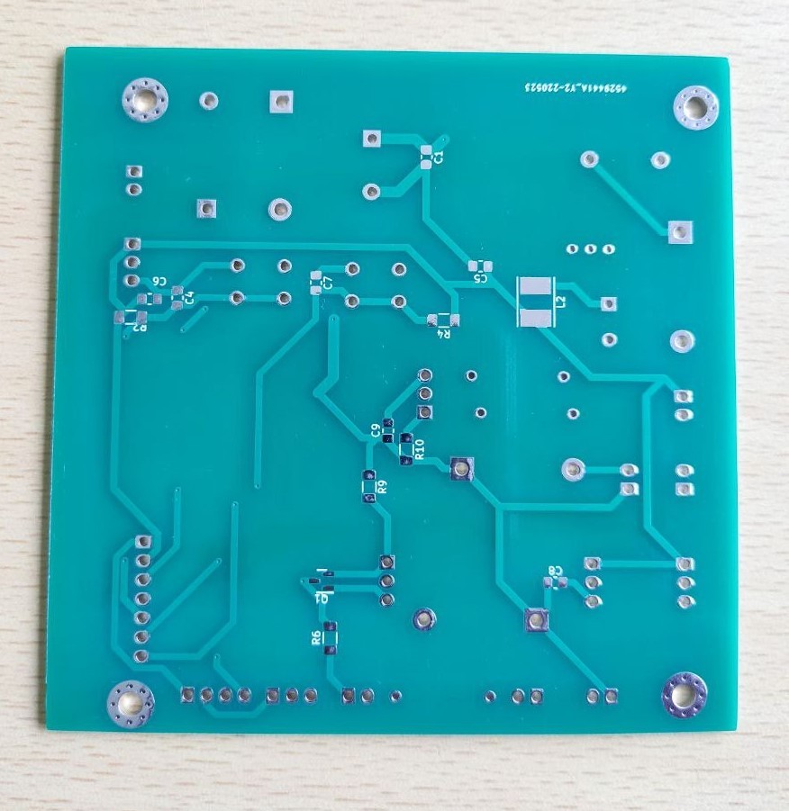

# Proceso de Montaje de componentes en la PCB

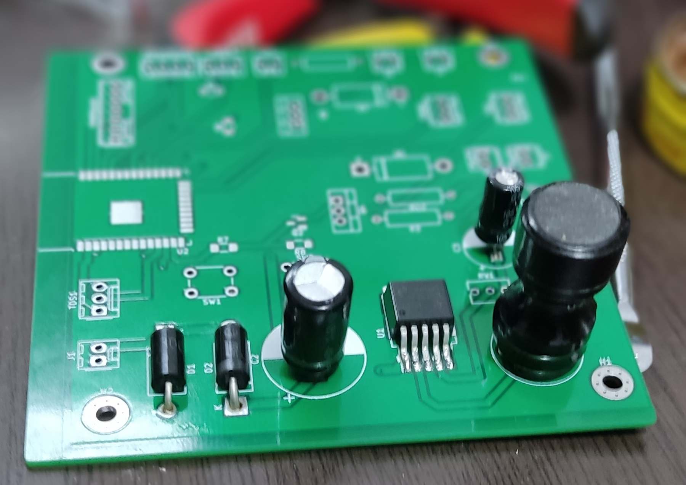

## Prueba de Pantalla

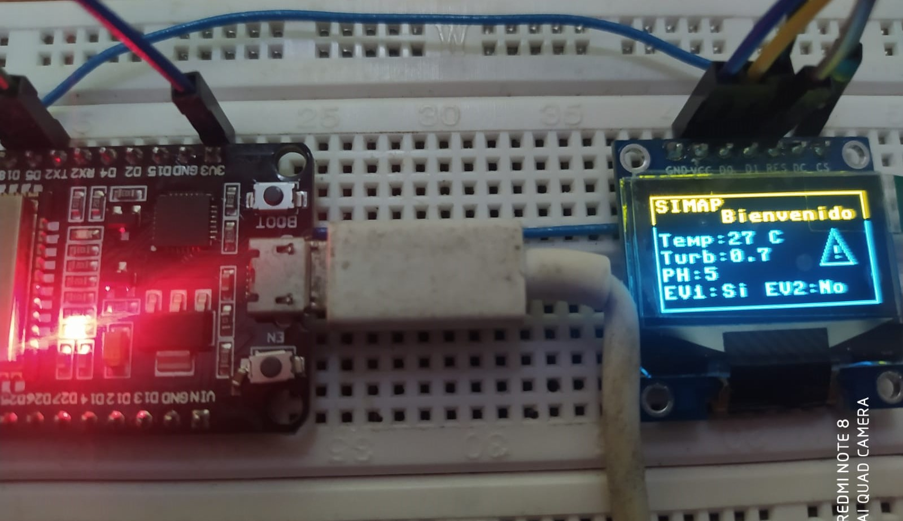

## Pruebas de sensores
se adjuntan videos de las pruebas de los sensores, mas adelante se redactara mejor esta seccion:

### Sensor de temperatura

<iframe width="640" height="352" src="Imagenes/Temp_Kish.mp4" type="video/mp4">
</iframe>

### Sensor de PH

<iframe width="854" height="480" src="Imagenes/PH_Juan.mp4" type="video/mp4">
</iframe>

### Sensor Turbidez

<iframe width="854" height="480" src="Imagenes/P_Turbio_1.mp4" type="video/mp4">
</iframe>
 

